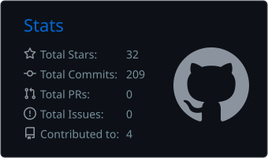
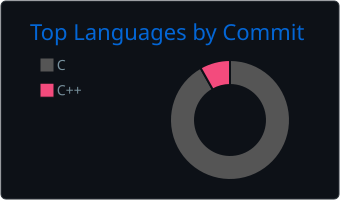

  
  
  

---

## 👨‍💻 About

## 💼 Experience

## 🛠️ Projects

| Project | Stack | Description |
|---|---|---|
| **WireFish** | C, Linux, libpcap | Packet sniffer like Wireshark/tcpdump. Parses IP, TCP, UDP, ICMP, HTTP, DNS, and FTP using multi-level inheritance. |
| **RTOS from Scratch** | ARM Assembly, C | Scheduler using PendSV for context switching and SVC for self-interrupts, with round-robin scheduling, task delays, and mutex synchronization. |
| **C++ Utilities Library** | C++17/20 | My own smart pointers, containers, iterators, and utilities built with type traits and concepts, plus tuple, move, and forward. |
| **HTTP Server** | C, Sockets, Linux | HTTP server that handles client requests via sockets. |
| **Custom Shell** | C, Linux | Shell built from scratch with internal and external command execution, redirection, and pipelining. |

## ⚙️ Skills

  

| Area | Skills |
|---|---|
| **C++ (17, 20)** | Templates, type traits, concepts, metaprogramming, STL (containers, iterators), ranges, smart pointers and RAII, move semantics, multithreading, OOP, Qt and QML |
| **Systems Programming** | Linux/POSIX, processes, signals, IPC, shared memory, memory mapping, synchronization |
| **Networking** | Socket programming, TCP/IP, HTTP |
| **Embedded Systems** | RTOS, Makefiles, startup and linker scripts, STM32/AVR, ARM assembly, UART, SPI, I2C, CAN |
| **Software Engineering** | Data structures and algorithms, object-oriented analysis and design, SOLID, design patterns, Git, Jira and Scrum |

## 🎓 Education

**B.Sc. Electronics and Communication Engineering**, Sohag University (Sep 2021 – Jun 2026)
Graduation project: post-quantum cryptography hardware acceleration in the GPGPU Vortex.

## 📚 Books I've Read

## 📊 GitHub Stats

## 📫 Get in Touch

Open to collaboration and new opportunities. Reach me by [email](mailto:menasaadna@gmail.com) or on [LinkedIn](https://www.linkedin.com/in/mina-saad-nazier-es/).

